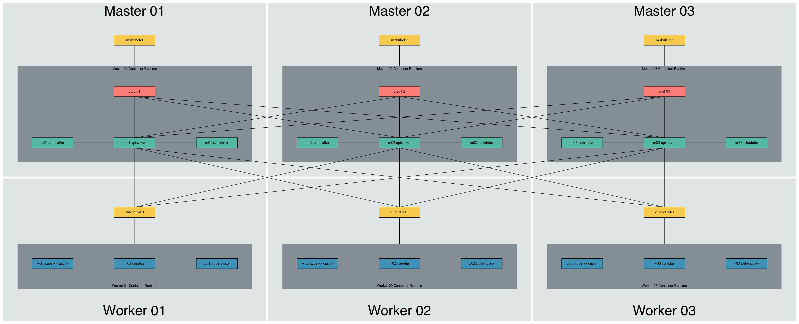

# kubeadm-ha-stacked-vagrant / Kubernetes v1.25.1


Kubernetes Cluster: kubeadm mgmt plane + (load balancer / 3 controller ctrl plane) + 3 executor data plane

## Vagrant Spin Up For 2 Load Balancers + 3 Masters + 3 Workers



### K8S 1.25.1

```console
                            |
                            |
                            |
┌────────────┐              ▼               ┌───────────┐
│    lb01    |------------------------------│   lb02    │
└──────┬─────┘                              └─────┬─────┘
       |                                          |       
       ├────────────────────┬─────────────────────┤      
       │                    │                     │      
┌──────▼─────┐       ┌──────▼─────┐        ┌──────▼─────┐
│     c01    │       │     c02    │        │     c03    │
└──────┬─────┘       └──────┬─────┘        └──────┬─────┘
       │                    │                     │      
       ├────────────────────┼─────────────────────┤      
       │                    │                     │      
┌──────▼─────┐       ┌──────▼─────┐        ┌──────▼─────┐
│     e01    │       │     e02    │        │     e03    │
└────────────┘       └────────────┘        └────────────┘
```

[Logfile](./run.log)
